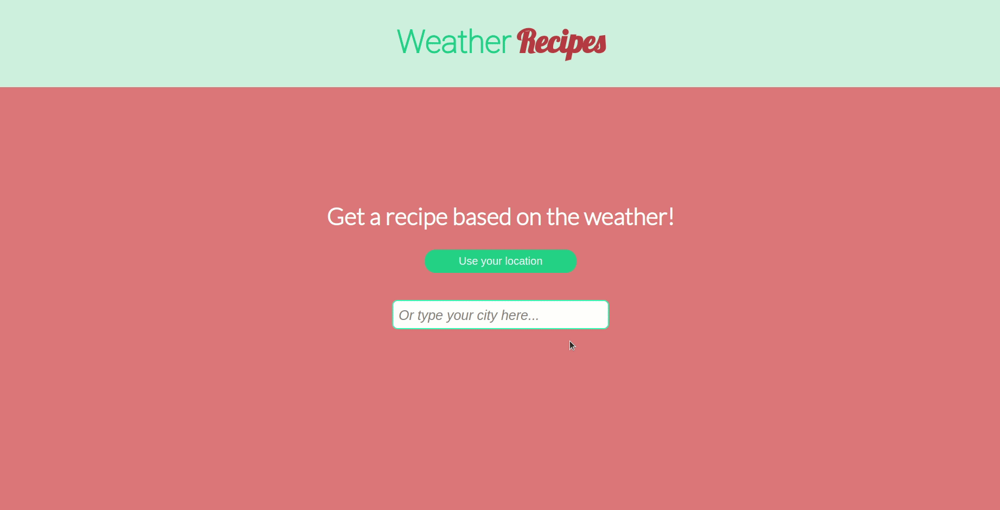

# Weather Recipes Frontend

This is a site where you can look for recipes that match the weather!

And it was developed for [Biz Capital](https://bizcapital.com.br/)'s selection process.

## Tolling

ReactJs 
Axios 

## Requirements

You must have node and npm installed and run `npm i` to install all necessary dependencies.

## Available Scripts

In the project directory, you can run:

### `npm start`

Runs the app in the development mode.\
Open [http://localhost:3000](http://localhost:3000) to view it in the browser.

The page will reload if you make edits.\
You will also see any lint errors in the console.

### Deployment

This application is deployed on Versel and there it uses the backend API that is deployed on Heroku, you can visit it without having to run any application locally by going to the url https://weatherrecipes-front.vercel.app/.
